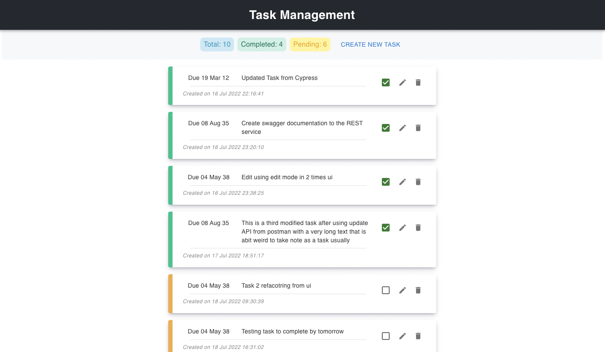
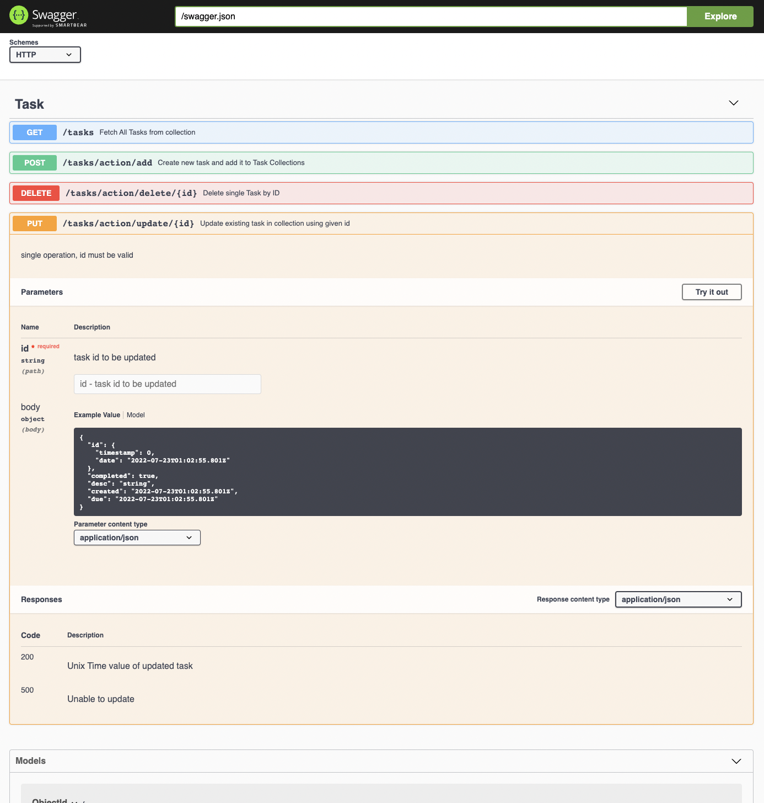
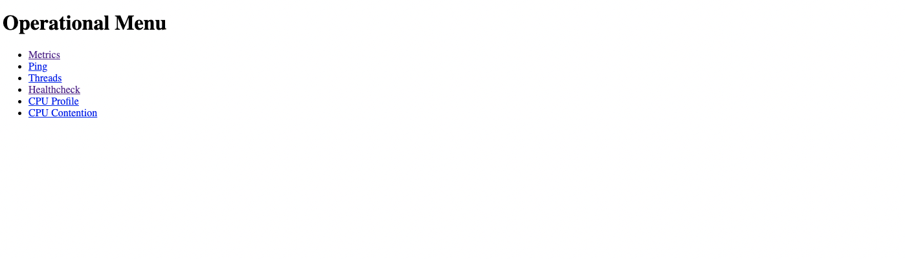
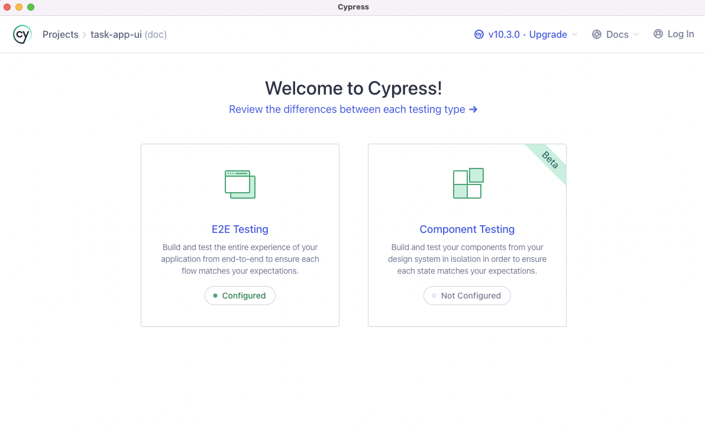
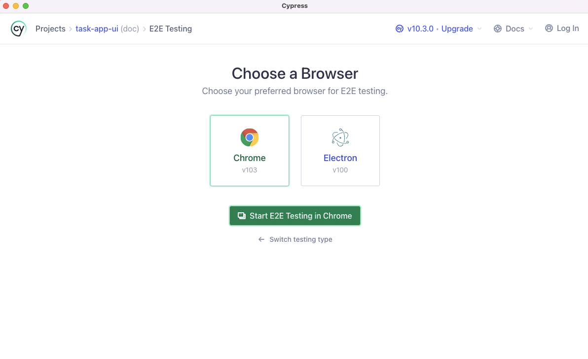
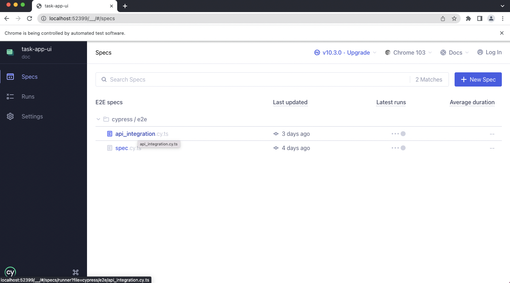
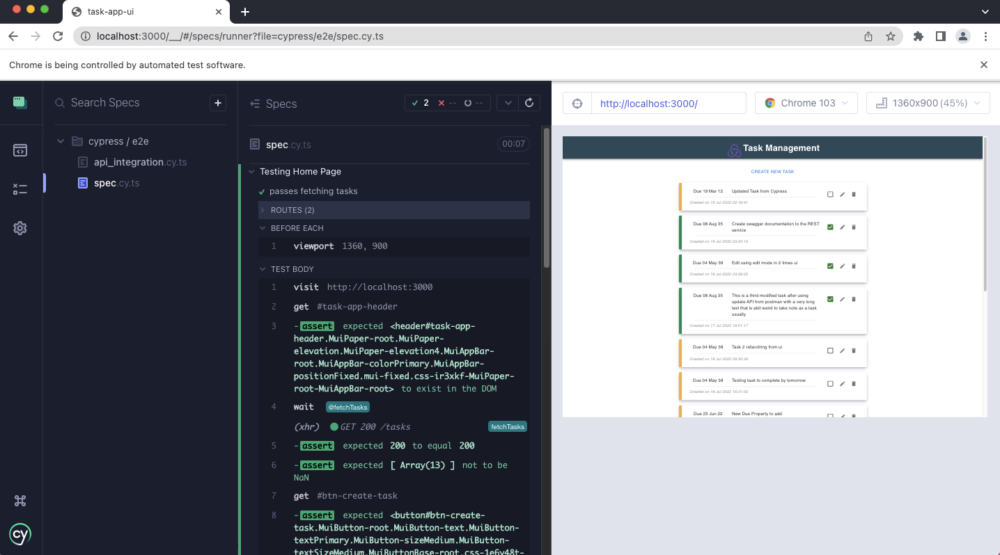
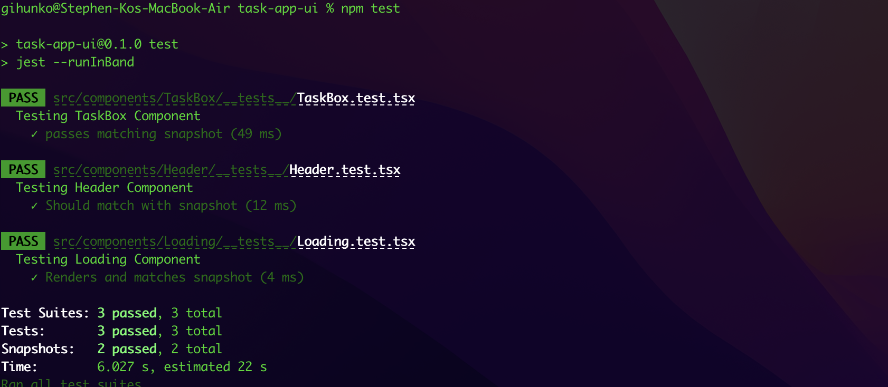

# TaskApp
Task App is a simple task management application, where you can simply retrieve, create, update and delete your tasks in real-time.

Below is the tech stack and major dependencies used for developing this application;

1. Front-end: ReactJS, Typescript, Redux, Material UI,
1. Back-end: Java, Dropwizard, Maven, Swagger
1. Data Storage (DB): MongoDB
1. Testing:
    - End 2 End Testing: Cypress
    - Integration Testing: Cypress (API integration testing)
    - Component Testing: Jest, Enzyme, React Testing Library
1. Deployment: Docker
1. CI/CD: Github Actions



## 1. Project Environment Setup and Running
> pre-requisite: Docker machine is required to be installed in your machine to run it locally.

Simply run the command below using docker to run task application services and task application UI.

`docker-compose up -d`

## 2. Task-App-Server

### 2.1 Swagger API Documentation
> pre-requisite: Task 1 (Set up and Running) should be completed in order to view API documentation on local.

Once docker container is up and running on your local machine, simply navigate to this address to view API documentation below;

`localhost:8080/swagger`



### 2.2 Health Check API
Health check API is available for testing DB connection with MongoDB from server. Port 8081 is opened for accessing health check. Simply navigate to the address on your local for viewing

`localhost:8081`



Below is the sample health check response for database connection and default deadlock checks

```
{
"database" : {
    "healthy" : true,
    "duration" : 324,
    "timestamp" : "2022-07-23T07:58:15.130Z"
},
"deadlocks" : {
    "healthy" : true,
    "duration" : 1,
    "timestamp" : "2022-07-23T07:58:15.131Z"
}
}
```

## 3. Cypress E2E Testing
> pre-requisite: 
> * cypress should be installed in your local machine
> * task-app-ui should be running in development mode with port 3000

* Switch current directory to `task-app-ui`
* Run the command `npx cypress open`

1. From the screenshot below, click `E2E Testing`

    

1. Click whichever browser that is available in your local machine (chrome suggested)
    

1. Click whichever spec file to test manually
    

1. Sample result after running e2e specification test script
    

## 4. Unit Component Testing
> pre-requisite: run `npm i` to install all necessary dependencies under `task-app-ui` directory

Simply run the command below to run component level testing

`npm test`

